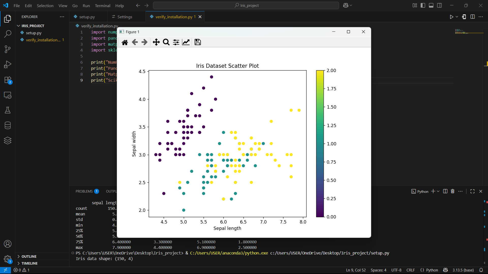

# Pertemuan 1 Lab - Iris Dataset Analysis
Nama:winson
NPM:2331064

## File Structure
- `setup.py` - Main analysis script
- `verify_installation.py` - Library verification
- `verify_output.txt` - Installation verification results
- `requirements.txt` - Required libraries

## Results

## Library Versions
- NumPy: 2.2.6
- Pandas: 2.3.2
- Matplotlib: 3.10.6
- Scikit-learn: 1.7.2